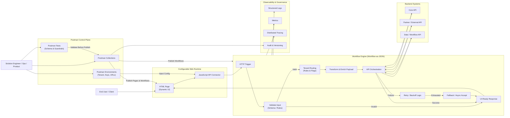

# Instant-Web-Delivery-UI-API-Workflows-Without-Redeployments
Deliver configurable, API-driven web experiences that evolve through configuration—not code. This project shows how Postman and JSON workflows enable instant UI updates, dynamic routing, and enterprise-ready governance across tenants and environments.

Here’s marketing-ready copy you can use to describe the feature (Postman-driven HTML/JS page creation + API connector + JSON workflow for routing/orchestration). I’m writing it so it can drop into a website, deck, or one-pager.

## Feature name ideas

* **Postman-Driven Web Experiences**
* **API-Connected Page Builder**
* **Workflow-as-JSON Delivery Platform**
* **Configurable Portal Pages (No-Rebuild)**

## What it is (positioning)

**Build and update full HTML pages (with JavaScript API connectors) directly from Postman—without redeploying your web app.**
Teams can publish UI modules, wire them to REST endpoints, and control the end-to-end behavior through a **JSON workflow** that routes requests, applies rules, and orchestrates API calls.

## Core value proposition

* **Ship UI updates instantly**: Update HTML/JS “pages” via Postman in minutes—no rebuild, no release window.
* **Connect to any API**: Standard REST connectors (GET/POST/PUT/DELETE), token headers, x-api-key routing, and environment variables.
* **Workflow is the product**: Define routing, validation, transformations, retries, and fallbacks using **JSON workflow definitions**.
* **Empower non-dev teams**: Product, operations, and solution engineers can safely publish content and flows with guardrails.

## Who it’s for

* **Solution Engineers / Sales Engineering**: Build demo portals fast, customize per client, and keep everything API-real.
* **Product Teams**: Launch new screens and experiences without waiting on app releases.
* **Operations**: Update forms, messages, and routing rules during incidents or process changes.
* **Developers**: Keep the platform stable while business logic + UX evolves through configuration.

## Key benefits (marketing bullets)

* **Zero-code updates (for UI + workflow rules)** using Postman collections & environments
* **Multi-tenant ready** with per-client configurations, keys, and routing policies
* **Consistent API governance** (headers, auth, throttling, schema validation, logging)
* **Reusable templates** for intake forms, admin portals, dashboards, and search pages
* **Faster time-to-value** for client onboarding, pilots, and proofs-of-concept

## Example use cases

* **Client-specific portals**: Same base app, different pages + workflows per customer.
* **Rapid onboarding & intake**: Publish forms that validate and submit directly to APIs.
* **Operational runbooks**: Update workflows (reroutes, fallbacks) instantly during outages.
* **Config-driven dashboards**: HTML widgets that call APIs and render KPIs on load.

---

# Marketing “Feature Overview” (short paragraph)

Using Postman as your control plane, teams can publish HTML pages and JavaScript API connectors directly into a configurable portal—no redeploy required. Workflows are defined in JSON to route requests, enforce rules, orchestrate API calls, and standardize authentication. The result is a faster, safer way to deliver client-specific experiences and API-driven portals with real governance and real-time updates.

---

---

## Postman messaging (how you’d describe it in marketing terms)

* **Postman Collection = Your publishing pipeline** (create/update pages, scripts, workflows)
* **Postman Environment = Tenant configuration** (base URLs, API keys, feature flags)
* **Requests = Deployments** (push UI page + JS connector + workflow JSON)
* **Tests = Guardrails** (schema checks, linting, smoke tests before publish)

---

Below is a **detailed, end-to-end Mermaid diagram** you can drop directly into your GitHub README or docs. It shows **Postman → HTML/JS Pages → JSON Workflow → API orchestration → Observability**, aligned with your marketing narrative.

---

## High-Level Architecture + Runtime Flow (Mermaid)

---

## How to Explain This Diagram (README-Ready)

### 1️⃣ Control Plane (Postman)

Postman acts as the **publishing, governance, and configuration layer**.
Teams use collections to deploy:

* HTML pages
* JavaScript API connectors
* JSON workflow definitions

Environments control **tenant routing, API keys, and URLs**, while tests enforce guardrails before changes go live.

---

### 2️⃣ Configurable Web Runtime

The web application itself is **stable and minimal**:

* HTML renders dynamic UI
* JavaScript connectors call APIs
* No business logic is hard-coded

All behavior is driven by configuration delivered from Postman.

---

### 3️⃣ Workflow-as-JSON Engine

Every request flows through a **JSON-defined workflow** that:

* Validates inputs
* Routes based on tenant or rules
* Transforms and enriches payloads
* Orchestrates one or more backend APIs
* Applies retries, fallbacks, and async handling
* Returns a **UI-ready response**

---

### 4️⃣ Backend APIs

Workflows can integrate with:

* Internal core systems
* External partner APIs
* Data and workflow services

All orchestration is centralized and governed.

---

### 5️⃣ Observability & Governance

Each workflow execution emits:

* Logs for troubleshooting
* Metrics for performance and success rates
* Traces for end-to-end visibility
* Audit records for versioning and compliance

---

## One-Line Diagram Caption (Marketing Use)

**A Postman-controlled platform where UI, API connectors, and workflows evolve through configuration—without redeploying applications.**

---

If you want next, I can:

* Create a **sequence diagram** (step-by-step request lifecycle)
* Provide a **multi-tenant variant** with per-client routing highlighted
* Add an **Azure-mapped version** (Functions, APIM, App Insights)

Just tell me how deep you want to go.
