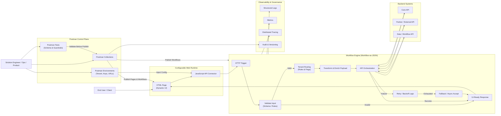

# Instant-Web-Delivery-UI-API-Workflows-Without-Redeployments
Deliver configurable, API-driven web experiences that evolve through configuration—not code. This project shows how Postman and JSON workflows enable instant UI updates, dynamic routing, and enterprise-ready governance across tenants and environments.

Here’s marketing-ready copy you can use to describe the feature (Postman-driven HTML/JS page creation + API connector + JSON workflow for routing/orchestration). I’m writing it so it can drop into a website, deck, or one-pager.

## Feature name ideas

* **Postman-Driven Web Experiences**
* **API-Connected Page Builder**
* **Workflow-as-JSON Delivery Platform**
* **Configurable Portal Pages (No-Rebuild)**

## What it is (positioning)

**Build and update full HTML pages (with JavaScript API connectors) directly from Postman—without redeploying your web app.**
Teams can publish UI modules, wire them to REST endpoints, and control the end-to-end behavior through a **JSON workflow** that routes requests, applies rules, and orchestrates API calls.

## Core value proposition

* **Ship UI updates instantly**: Update HTML/JS “pages” via Postman in minutes—no rebuild, no release window.
* **Connect to any API**: Standard REST connectors (GET/POST/PUT/DELETE), token headers, x-api-key routing, and environment variables.
* **Workflow is the product**: Define routing, validation, transformations, retries, and fallbacks using **JSON workflow definitions**.
* **Empower non-dev teams**: Product, operations, and solution engineers can safely publish content and flows with guardrails.

## Who it’s for

* **Solution Engineers / Sales Engineering**: Build demo portals fast, customize per client, and keep everything API-real.
* **Product Teams**: Launch new screens and experiences without waiting on app releases.
* **Operations**: Update forms, messages, and routing rules during incidents or process changes.
* **Developers**: Keep the platform stable while business logic + UX evolves through configuration.

## Key benefits (marketing bullets)

* **Zero-code updates (for UI + workflow rules)** using Postman collections & environments
* **Multi-tenant ready** with per-client configurations, keys, and routing policies
* **Consistent API governance** (headers, auth, throttling, schema validation, logging)
* **Reusable templates** for intake forms, admin portals, dashboards, and search pages
* **Faster time-to-value** for client onboarding, pilots, and proofs-of-concept

## Example use cases

* **Client-specific portals**: Same base app, different pages + workflows per customer.
* **Rapid onboarding & intake**: Publish forms that validate and submit directly to APIs.
* **Operational runbooks**: Update workflows (reroutes, fallbacks) instantly during outages.
* **Config-driven dashboards**: HTML widgets that call APIs and render KPIs on load.

---

# Marketing “Feature Overview” (short paragraph)

Using Postman as your control plane, teams can publish HTML pages and JavaScript API connectors directly into a configurable portal—no redeploy required. Workflows are defined in JSON to route requests, enforce rules, orchestrate API calls, and standardize authentication. The result is a faster, safer way to deliver client-specific experiences and API-driven portals with real governance and real-time updates.

---

---

## Postman messaging (how you’d describe it in marketing terms)

* **Postman Collection = Your publishing pipeline** (create/update pages, scripts, workflows)
* **Postman Environment = Tenant configuration** (base URLs, API keys, feature flags)
* **Requests = Deployments** (push UI page + JS connector + workflow JSON)
* **Tests = Guardrails** (schema checks, linting, smoke tests before publish)

---
Absolutely—here’s a **marketing-grade expansion** of the **Core Value Proposition**, written so you can lift sections directly into a website, pitch deck, or product one-pager. I’ve kept the tone clear, confident, and business-focused, while still resonating with technical buyers and solution architects.

---

## Core Value Proposition (Expanded)

### 🚀 Ship UI & Workflow Changes Instantly — No Rebuilds, No Downtime

Traditional web platforms require code changes, CI/CD pipelines, and release windows just to update a page or tweak a flow. With our **Postman-driven delivery model**, teams can publish **HTML pages, JavaScript connectors, and API workflows** instantly—without recompiling or redeploying the application. Updates take minutes, not sprints, enabling real-time responsiveness to business needs.

---

### 🔌 API-First by Design — Connect to Anything, Anywhere

Every page is natively wired to APIs using standard REST patterns. JavaScript connectors support dynamic headers, tokens, x-api-keys, environment variables, and tenant-based routing. This means your UI is never static—it’s a live, API-connected experience that can integrate seamlessly with existing platforms, partner systems, or cloud services.

---

### 🧠 Workflow Is the Product — Logic Lives in JSON, Not Code

Business logic, routing rules, validation, retries, transformations, and fallbacks are defined in **JSON workflows**, not hard-coded applications. This allows organizations to evolve processes independently of engineering cycles. Workflow updates can be reviewed, versioned, tested, and deployed just like APIs—bringing true **configuration-driven delivery** to the enterprise.

---

### 🧩 Empower Non-Developer Teams (Safely)

Product managers, solution engineers, and operations teams can confidently update pages and workflows using Postman—without direct access to the application codebase. Built-in guardrails (schema validation, required fields, environment isolation) ensure changes are safe, consistent, and auditable. Engineering teams stay focused on platform stability while the business moves faster.

---

### 🏢 Multi-Tenant, Client-Aware, Enterprise-Ready

The same application can serve multiple clients, regions, or environments using **tenant-aware configuration**. Per-client workflows, branding, API routing, and feature flags are controlled via JSON and environment variables—eliminating the need for forks or duplicate deployments. This is ideal for SaaS platforms, consulting accelerators, and white-label solutions.

---

### 🔐 Governance, Observability, and Control Built In

Every request is traceable. Workflows support structured logging, correlation IDs, retries, and metrics—making them easy to monitor and troubleshoot. Combined with Postman collections and tests, teams gain a governed, auditable, and observable delivery model that meets enterprise standards for security and compliance.

---

### ⏱ Faster Time-to-Value for Demos, Onboarding, and Change

Whether launching a new client portal, customizing a demo, or responding to operational change, teams can go from idea to live experience in hours—not weeks. This dramatically improves customer onboarding, accelerates proof-of-concepts, and reduces the cost of change across the organization.

---

## One-Sentence Value Summary (for slides)

**Deliver dynamic, API-connected web experiences that evolve through configuration—not redeployment—using Postman and JSON-driven workflows.**

---

Below is a **clear, expanded, marketing-ready version of “What it’s for”**, written to explain *why* organizations adopt this capability and *where* it delivers the most impact. This is suitable for websites, pitch decks, RFP responses, or solution briefs.

---

## What It’s For

### ⚡ Accelerating Change Without Engineering Bottlenecks

This capability exists to eliminate the dependency on full development cycles for everyday changes. Organizations use it to **update pages, flows, and integrations instantly**—without waiting for sprint planning, code merges, or release windows. It turns routine updates into configuration changes instead of software projects.

---

### 🧩 Building Dynamic, API-Driven Portals

It’s designed for creating **live, API-connected portals**—not static websites. Forms, dashboards, admin pages, and client experiences are rendered in HTML and JavaScript but powered entirely by APIs. As backend systems evolve, the UI adapts through workflow configuration rather than rewrites.

---

### 🏢 Supporting Multi-Client & Multi-Tenant Solutions

For SaaS platforms, consulting accelerators, and enterprise portals, this approach is ideal for **client-specific customization**. Each customer can have unique pages, workflows, routing rules, branding, and API destinations—without duplicating applications or maintaining forks.

---

### 🛠 Empowering Solution Engineers & Operations Teams

It’s built so **non-developers can safely own delivery**. Solution engineers can tailor experiences for demos and pilots. Operations teams can adjust routing, validation, and fallback behavior during incidents. Product teams can launch new flows independently—while engineering focuses on platform stability.

---

### 🚀 Rapid Prototyping, Demos, and Proofs of Concept

This is a powerful tool for **sales engineering and innovation teams**. Teams can assemble realistic, API-backed demos in hours, not weeks—using real workflows and data paths. This shortens sales cycles, improves stakeholder confidence, and reduces throwaway prototype work.

---

### 🔄 Orchestrating Business Processes Across Systems

The JSON workflow layer is used to **coordinate multiple backend systems**—validating inputs, enriching data, routing requests, retrying on failure, and returning UI-ready responses. This makes it ideal for onboarding, intake, approvals, requests, and operational processes that span multiple APIs.

---

### 🔐 Enforcing Governance Without Slowing Teams Down

Organizations use this to balance **speed with control**. Changes are versioned, testable, auditable, and environment-scoped through Postman. Standard headers, auth patterns, and observability are enforced centrally—without blocking teams from moving fast.

---

### 📈 Reducing Cost of Change Over Time

Instead of paying the “tax” of repeated development, testing, and redeployment, teams use this approach to **lower the long-term cost of change**. The platform stays stable while workflows and UI evolve continuously through configuration.

---

## In Plain Terms (Executive-Friendly)

**It’s for organizations that want to move faster without breaking governance—by turning UI and workflow changes into configuration instead of code.**

---

## One-Line “What It’s For” (Website-Ready)

**To deliver configurable, API-driven web experiences that evolve instantly—without redeploying applications or slowing down teams.**

---

If you want next, I can:

* Turn this into a **“Problem → Solution → Outcome”** section
* Map “What it’s for” to **specific industries** (Insurance, Healthcare, Public Sector, Financial Services)
* Create a **diagram-backed explainer** that visually shows *why* this exists

Just say the word.

Just tell me how you plan to use it.

Below is a **detailed, end-to-end Mermaid diagram** you can drop directly into your GitHub README or docs. It shows **Postman → HTML/JS Pages → JSON Workflow → API orchestration → Observability**, aligned with your marketing narrative.

---

## High-Level Architecture + Runtime Flow (Mermaid)

---

## How to Explain This Diagram (README-Ready)

### 1️⃣ Control Plane (Postman)

Postman acts as the **publishing, governance, and configuration layer**.
Teams use collections to deploy:

* HTML pages
* JavaScript API connectors
* JSON workflow definitions

Environments control **tenant routing, API keys, and URLs**, while tests enforce guardrails before changes go live.

---

### 2️⃣ Configurable Web Runtime

The web application itself is **stable and minimal**:

* HTML renders dynamic UI
* JavaScript connectors call APIs
* No business logic is hard-coded

All behavior is driven by configuration delivered from Postman.

---

### 3️⃣ Workflow-as-JSON Engine

Every request flows through a **JSON-defined workflow** that:

* Validates inputs
* Routes based on tenant or rules
* Transforms and enriches payloads
* Orchestrates one or more backend APIs
* Applies retries, fallbacks, and async handling
* Returns a **UI-ready response**

---

### 4️⃣ Backend APIs

Workflows can integrate with:

* Internal core systems
* External partner APIs
* Data and workflow services

All orchestration is centralized and governed.

---

### 5️⃣ Observability & Governance

Each workflow execution emits:

* Logs for troubleshooting
* Metrics for performance and success rates
* Traces for end-to-end visibility
* Audit records for versioning and compliance

---

## One-Line Diagram Caption (Marketing Use)

**A Postman-controlled platform where UI, API connectors, and workflows evolve through configuration—without redeploying applications.**

---

If you want next, I can:

* Create a **sequence diagram** (step-by-step request lifecycle)
* Provide a **multi-tenant variant** with per-client routing highlighted
* Add an **Azure-mapped version** (Functions, APIM, App Insights)

Just tell me how deep you want to go.
